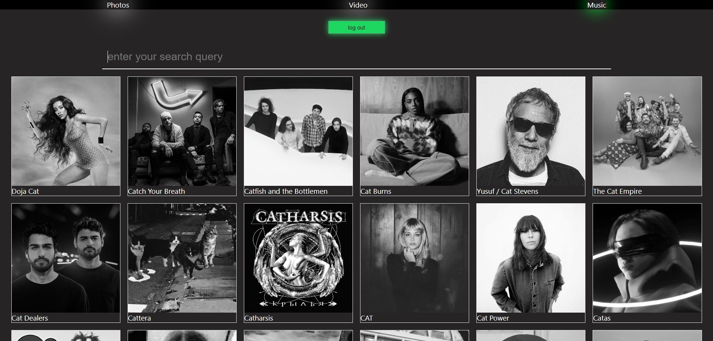

# Pictures, videos and music finder Application

This is an application built with React, HTML, CSS, JS, and a REST API. It allows users to search pictures, videos and music.

## Table of Contents

Installation

Usage

Contributing

### Installation

To install the application, follow these steps:

Clone the repository to your local machine.
Open a terminal and navigate to the root directory of the project.
Run npm install to install the dependencies.
Run npm start to start the development server.
Open http://localhost:3000 in your browser.

### Usage

To use the application, follow these steps:

Enter the query in the search bar.
Click on the "Search" button or press Enter to retrieve the search results.
The application will display a list of matching your search query.
Click on a picture from the list to view big picture/ full video.

At music rout click log-in button, then you will be redirected to the login page of your spotify account, click "accept" and then you will be redirected back to the application page, then enter your search query in the search bar and press Enter. Now you can see the list of artists and tracks matching your search query.
You can press the artist/tracks you want to listen and enjoy the music.

### Contributing

Contributions to this project are welcome. To contribute, follow these steps:

Fork the repository to your own GitHub account.
Create a new branch from the main branch.
Make your changes and commit them with descriptive commit messages.
Push your changes to your forked repository.
Create a pull request to merge your changes into the main branch of this repository.
